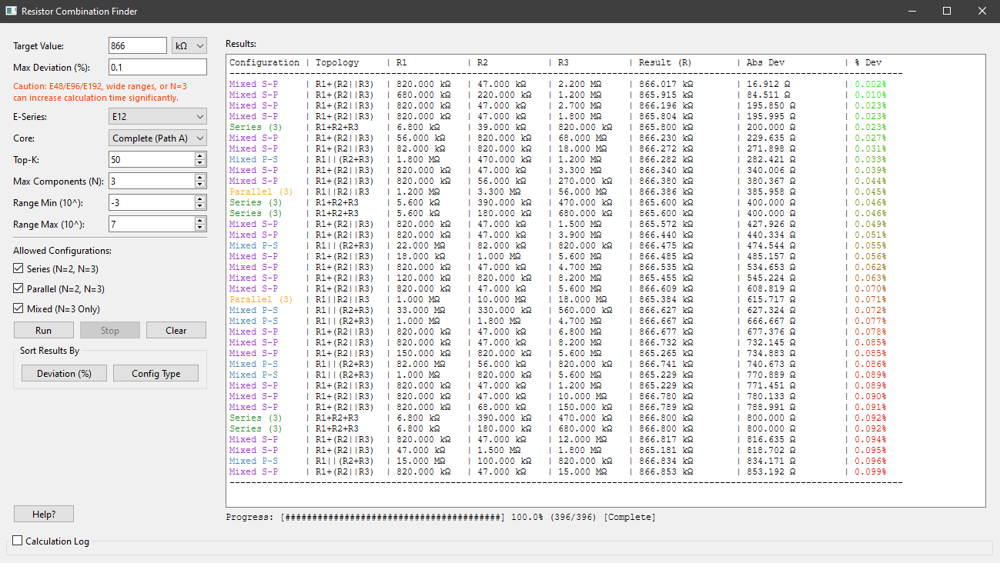
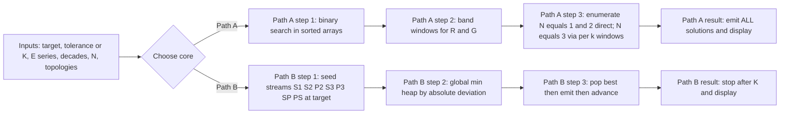

# Resistor Combination Finder

*Ever tried to hit a weird target resistance and spent ages juggling E-series parts in series/parallel?*
This app does the book-keeping and instantly computes either **(1)**: **every** valid combo within your tolerance (**Path A**) or **(2)**: the **Top-K#** closest matches (**Path B**).



## Quick start

```bash
git clone https://github.com/4rvyn/resistor_finder.git
cd resistor_finder
pip install -r requirements.txt
python main.py
```

Tested on Windows 10+, Python 3.13+.

## Using it

Enter target + tolerance, choose E-series, decades, N (1–3), and topologies.
Pick a **Compute core**:

* **Path A:** exhaustive within ±tolerance (deterministic & complete).
* **Path B:** best-first global search; returns exactly **K#**-number of best matches.

Then **Run** and (optionally) sort by **Deviation (%)** or **Config Type**.

> \[!TIP]
> Use **Path B (Top-K)** to scout great candidates in milliseconds, then —if needed— switch to **Path A** for a complete set within your tolerance.

> \[!WARNING]
> **Path A with wide ranges (E96 + wide decades + N=3 + Mixed) will generate millions of results and can crash the app.** Use **Top-K** to explore safely.

## Compute cores (what actually happens)



*In short:* **Path A** slices the sorted pair tables by your tolerance band to guarantee completeness.
**Path B** runs a multi-stream best-first search (one global heap, no heuristic bias) that always yields the **true** Top-K fastest.

## Precompute

Binary tables live in `assets/`:

* `rcf_e12.bin`, `rcf_e24.bin`, `rcf_e96.bin`: sorted singles and pair sums used by both cores.

Regenerate / validate (optional):

```bash
python precomp.py
python precompval.py
```

> \[!NOTE]
> If you want to change E-series or decade coverage, re-run `precomp.py` with your values so both cores stay fast and correct.

## License

MIT: see [LICENSE](LICENSE).
